# ~/.claude - Claude Code カスタム環境

Claude Code の開発ワークフローを拡張するスキル・エージェント・ツール群。

## ワークフロー

スキルはプロジェクトのライフサイクルに沿って連携する。典型的な流れは以下の通り。

```mermaid
graph TD
    subgraph "プロジェクト開始"
        A["/spec-gen"] -->|"設計ドキュメント + feat Issue"| B["/impl &#35;Issue"]
        B -->|"実装 → レビュー → PR"| C["/code-review-git"]
        C -->|"PR前のセルフレビュー"| C2["/doc-drift-git"]
        C2 -->|"ドキュメント整合性チェック"| D["/release"]
        D -->|"Changelog + タグ + GitHub Release"| E((完了))
    end

    subgraph "運用・保守"
        F["/bug-report"] -->|"バグを調査して Issue 作成"| G["/bug-fix &#35;Issue"]
        G -->|"修正 → テスト → PR"| H((完了))
        I["/code-review"] -->|"コードベース全体の品質チェック"| J((レポート))
        K["/doc-drift"] -->|"ドキュメントと実装の乖離検出"| L((レポート))
    end
```



> **Git 差分版**: `/code-review-git`, `/doc-drift-git` で変更差分のみを対象にチェック可能。

### 典型的なシナリオ

| シナリオ | 手順 |
|---------|------|
| **新機能を作る** | `/spec-gen` → 設計 → `/impl #Issue` → 実装 → `/code-review-git` → セルフレビュー → `/doc-drift-git` → ドキュメント整合性チェック → PR |
| **バグを直す** | `/bug-report` → Issue 作成 → `/bug-fix #Issue` → 修正 → PR |
| **リリースする** | `/release` → Changelog + タグ + GitHub Release |
| **品質を確認する** | `/code-review` で全体チェック、`/doc-drift` でドキュメント乖離チェック |

## スキル (`skills/`)

スラッシュコマンド（`/skill-name`）で呼び出せるワークフロー定義。
日本語版と英語版（`-en`サフィックス）を用意しているスキルもある。

> **Worktree 版**: `-wt` サフィックス付きのスキルは git worktree で隔離した環境で作業し、本体ブランチに影響を与えない。

### 仕様・設計

| スキル | 概要 |
|--------|------|
| `/spec-gen` | 新規プロジェクトの設計ドキュメント一式を対話的に作成。既存仕様書への追記にも対応 |
| `/spec-review` | 仕様書をレビューし、指摘を1件ずつユーザー確認しながら修正 |
| `/issue-split-auto` | 大きな Issue を非対話でスコープ単位のサブ Issue に自動分割（issue-sweep 連携用） |
| `/spec-to-hugo` | 既存の仕様書ディレクトリをHextraテーマのHugoサイトに変換。Mermaid図ズーム・PDF埋め込み・Netlifyデプロイ対応 |
| `/design-spec` | 対話的にデザイン仕様書（UI/UX）を作成・既存ドキュメントに追記 |
| `/design-review` | UIコンポーネントのデザイン品質をレビューし、Issueまたはレポートとして生成 |
| `/design-request` | デザインを見ながら対話で変更要望をまとめ、構造化されたIssueを作成 |
| `/design-fix` | デザインレビューやデザイン変更Issueの指摘を修正し、デザイン検証付きでPRを作成 |
| `/rfp` | 対話形式でヒアリングし、構造化されたRFP（提案依頼書）をMarkdownで作成 |
| `/halt` | HALT（HTMX+Atomic+Lit+Templ）フロントエンドアーキテクチャを仕様書に追加 |

### 実装

| スキル | 概要 |
|--------|------|
| `/impl` | 要件→スコープ分割→実装→レビュー→コミット→PRを小スコープで反復 |
| `/impl-wt` | git worktree で隔離した環境で実装サイクルを回し、PRを作成 |
| `/impl-r` | `/impl` → `/refine-git` を連続実行し、実装から研磨・CI 緑マージまで一気通貫 |
| `/impl-wt-r` | `/impl-wt` → `/refine-git` を worktree 隔離で連続実行し、実装から研磨・CI 緑マージまで一気通貫 |
| `/issue-sweep` | 複数 Issue をキュー化し Stop Hook と連動して端から自律連続実装・PR マージまで進める。`--parallel N` で並列、`--abort` で中止。実行中の同一プロジェクトでの並行作業は別 worktree から行うこと |

### バグ

| スキル | 概要 |
|--------|------|
| `/bug-report` | 対話形式でバグをヒアリングし、コード調査の上で構造化されたGitHub Issueを作成 |
| `/bug-fix` | 再現確認→原因特定→修正→回帰テストを体系的に実行 |
| `/bug-fix-wt` | git worktree で隔離した環境でバグ修正・回帰テスト・PR作成 |

### レビュー・品質

| スキル | 概要 |
|--------|------|
| `/code-review` | コードベース全体の品質チェックとリファクタリングレビュー。レポート生成 |
| `/code-review-git` | gitリモートとの差分を対象にコード品質チェック＋ドキュメント乖離検出 |
| `/refine-git` | **PR の差分のみ**を対象に review→修正→再review を反復し critical/major=0 ∧ minor≤閾値 まで研磨後、CI 緑を待ってマージ + Issue close まで実行（`--no-merge` で研磨のみ）。実装 PR の研磨はこちらが既定 |
| `/refine` | **リポジトリ全体**を対象に同じループを回し、修正を 1 本の PR にまとめる。小〜中規模リポジトリの一括クリーンアップ用 |
| `/refine-sweep` | 全コードベースに対して 4 観点 review→fix→PR→merge を反復し critical/major/minor をゼロまで磨く（`--no-minor` で軽量モード）。仕様書のドメイン軸で並列 PR。spinoff も自動 `/issue-sweep` 委譲で実装まで完了 |
| `/doc-drift` | ドキュメントと実装コードの整合性をチェックし、乖離レポートを生成 |
| `/doc-drift-git` | gitリモートとの差分を対象にドキュメントとコードの整合性チェック |
| `/spec-audit-git` | gitリモートとの差分を対象に仕様乖離・TODO・スキップテストを検知（`--report-only` で Issue 化なし） |

### リリース・運用

| スキル | 概要 |
|--------|------|
| `/release` | Changelog生成・バージョンタグ・GitHubリリースノート作成・レジストリpublish |
| `/resolve-conflicts` | PR番号を指定してコンフリクトをgit worktreeで安全に解消 |

### メタ（スキル管理）

| スキル | 概要 |
|--------|------|
| `/skill-creator` | Anthropic公式ガイドに基づく高品質なスキル作成。プログレッシブディスクロージャ・トークン最適化対応 |
| `/skill-reviewer` | 既存スキルを公式ガイド基準で監査し、改善点を提示 |

## エージェント (`agents/`)

Task ツールの `subagent_type` で指定して使うカスタムエージェント。

| エージェント | 概要 |
|-------------|------|
| `develop` | 最小限のコード変更を実装する開発者エージェント |
| `review` | 読み取り専用でコード変更をレビューするエージェント |

## ツール (`tools/`)

### swm - LLMプロバイダー切り替えCLI

複数の LLM プロバイダー（Claude, GLM, DeepSeek, ローカル等）の環境変数をワンコマンドで切り替える Go ツール。

```bash
# セットアップ
cd ~/.claude/tools/swm && make install
swm init

# ~/.bashrc or ~/.zshrc に追加
eval "$(swm env)"
```

| コマンド | 動作 |
|---------|------|
| `swm init` | `~/.claude/llm/providers.yaml` を生成 |
| `swm use <name>` | アクティブプロバイダーを切り替え |
| `swm current` | 現在のプロバイダーとモデルを表示 |
| `swm list` | 全プロバイダー一覧（アクティブに★） |
| `swm env` | 環境変数を `export` 形式で出力 |

## ディレクトリ構成

```
~/.claude/
├── CLAUDE.md              # グローバル指示（コミット規約・コーディング方針）
├── settings.json          # Claude Code 設定
├── skills/                # スラッシュコマンドで呼べるスキル定義
├── agents/                # カスタムエージェント定義
├── tools/swm/             # swm CLI ソースコード
└── llm/
    ├── providers.yaml     # LLM プロバイダー定義
    └── active             # 現在のアクティブプロバイダー
```
